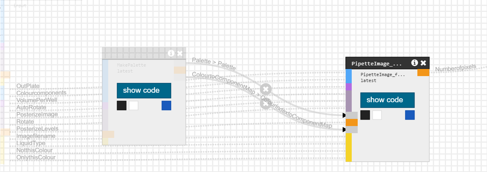

## Lesson 0: PipetteImage Example

The protocol in this folder will generate instructions to pipette images on microtitre plates. You can run it by typing antharun. 

To run an Antha Workflow with Antharun two types of files are needed: 

1. A worflow definition file
2. A parameters file 

### Workflow:
The workflow file specifies a set of Processes which call Antha elements 
(components) which are to be run. 
This could be: 

(A) A single element run once 

(B) parallel copies of a single element run in parallel, for example multiple runs of the same protocol for different samples or with different conditions.

(C) multiple different elements run at the same time

(C) multiple elements which may be connected; i.e. one or more outputs (ports) from a source element (src) may feed in as inputs (also ports) into the downstream target element (tgt).

The workflow.json file found in this folder corresponds to the following workflow showing two antha elements, MakePalette and PipetteImage_fromPalette. Two outputs of MakePalette are fed into PipetteImage fromPalette as inputs: Palette and ColoiurtoComponentmap.

### Parameters:
The parameters file assigns parameters for each of the processes specified in the workflow file

i.e. the parameters file is used to set the values for the input parameters of the processes specified in the workflow file.
In this case, Make Palette:

and PipetteImage_fromPalette:

The example parameters files in these folders show how to set variables specified in the parameters file to the actual values we want to assign to them.
One of the key variables you'll likely want to set are the liquid handling components (wtype.LHComponent) 

